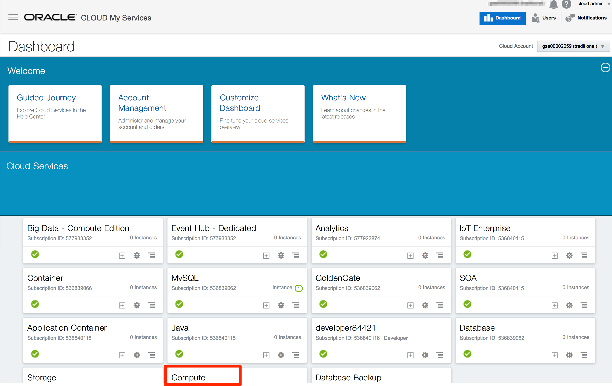
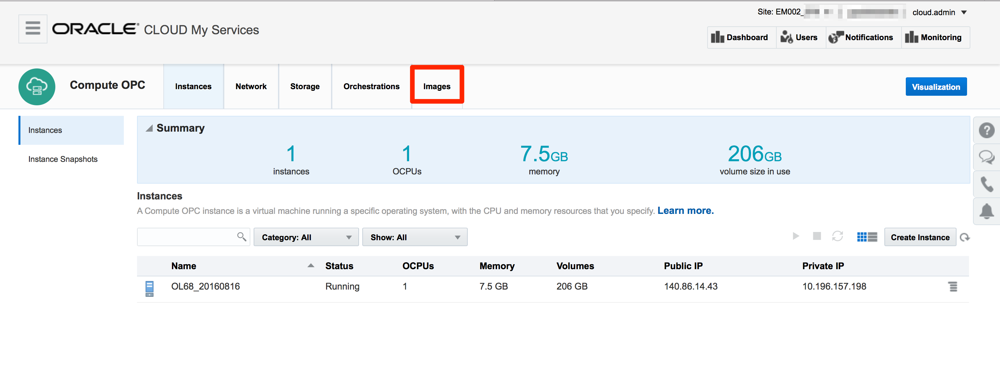
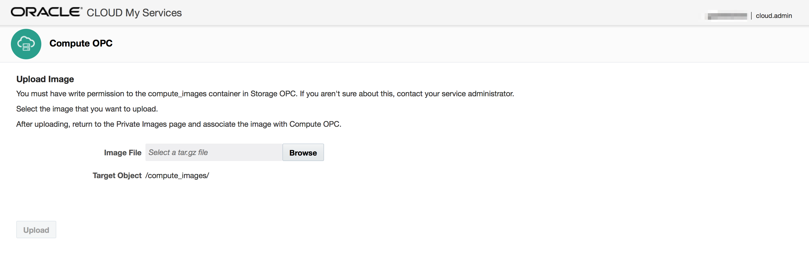
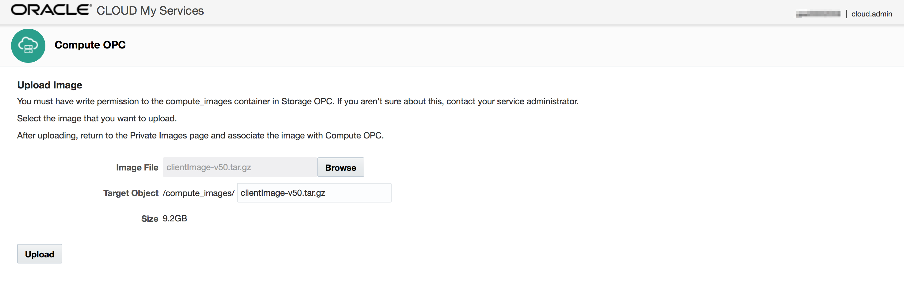
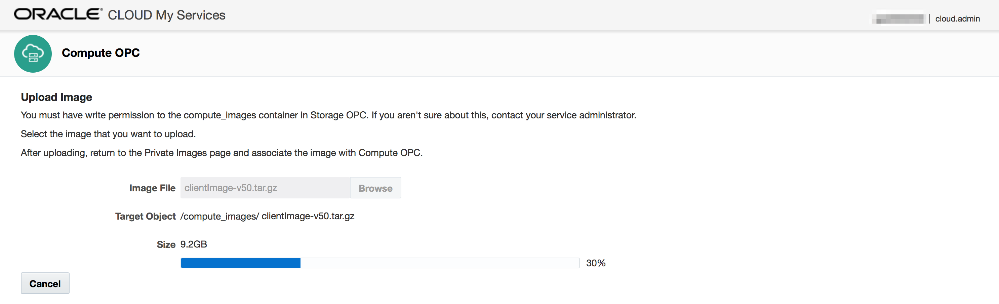
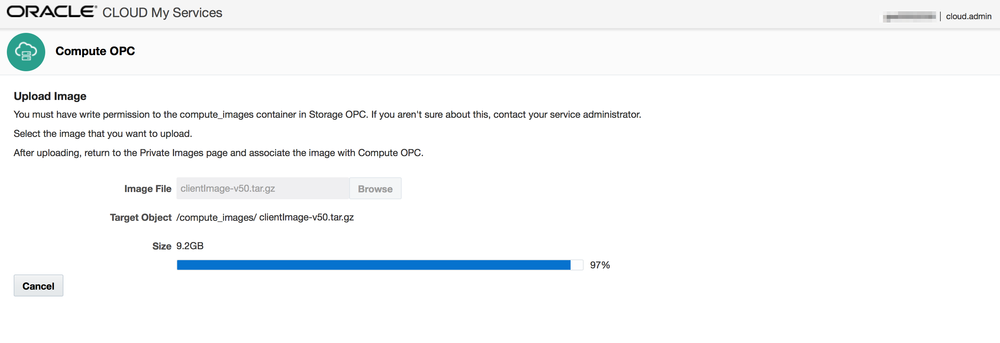
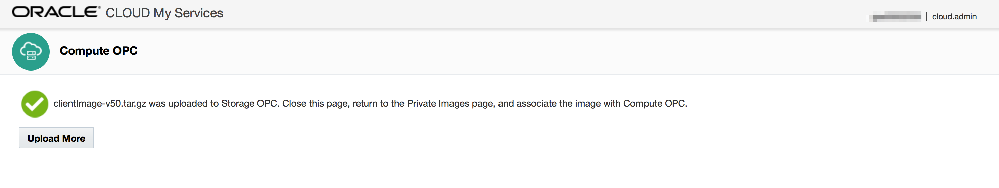
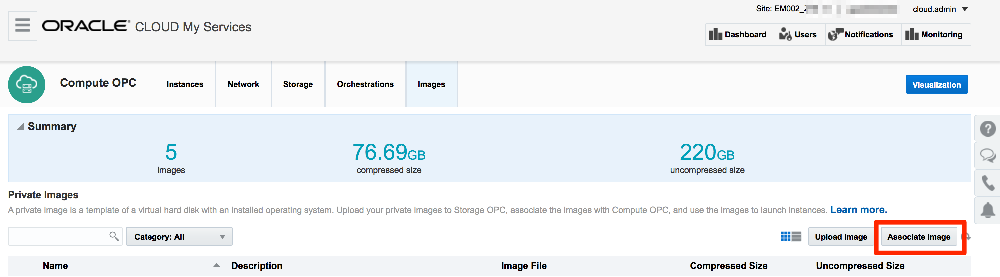
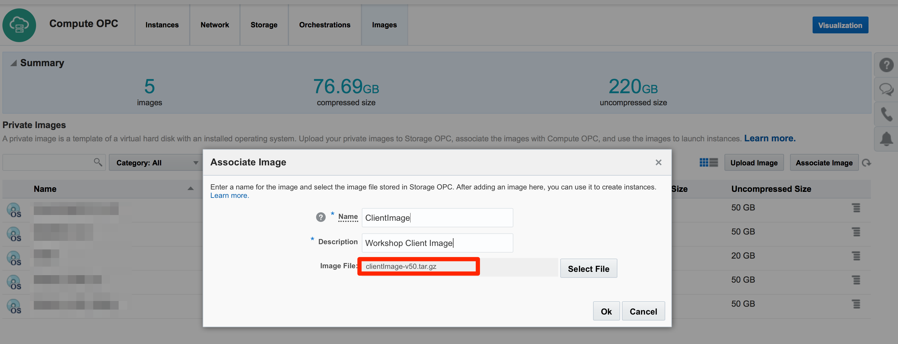

# Oracle Public Cloud Client Installation

- This how-to guide is best viewed using the Workshop's [GitHub Pages Website URL](https://pcdavies.github.io/ClientImageSetup/)

The "Client Image" is an Oracle Linux-based Virtual Machine.  Generally, we deploy this image to the Oracle Public Cloud as an alternative (or in addition) to installing Eclipse, Brackets and Git on your laptop.

The Client is then accessed using a VNC Client (the only requirement on your machine), through which you can complete all labs steps.

### Requirements

- You will need a to have a minimum set of resources available in your public cloud compute:
-- 1 OCPU
-- 1 Public IP address
-- 100 GB of Storage Service space.

- You will privileges on your identiy domain to instantiate the image.

- [Download](https://www.virtualbox.org/wiki/Downloads) and install the image using the instructions below. 

### Download the multipart ZIP files which container the bigger tar.gz file

**Note**: you will download all X zip files, they are all part of the single, multi-part archive. Then, you can use software such as winzip or 7zip to automatically unzip all X files into the single *.tar.gz file that can then be uploaded, assocated and booted as a new instance of the image.

- Download this workshops [zip files](https://publicdocs-corp.documents.us2.oraclecloud.com/documents/link...77E4725F3/_VM), and unzip.

### Unzip and upload the tar.gz File

- Log into your Identity Domain **Oracle Public Cloud**

    

- Install the VirtualBox Extentions for windows

- From top left menu select **File -> Import Appliance**

    

- Click on **browse** icon to select file to import.

- Navigate to the unzipped OVA file, and Click **Open**

    

- Once the File is selected click **Next** to continue.

    

- Keep all the defaults and click **Import**

    

- Wait for import to complete. The time required to import will vary depending on the speed of your hard disk.

    
    
    
    

### Start Virtual Box Image

- After completion of the import, you should see the Oracle Public Cloud image in a Powered Off state. The default settings will work, but if you are familiar with Virtual Box, you are welcome to change any of the settings.

- With the **Oracle Public Cloud** selected, click **Start**.

    

- After a few minutes you will have a running image that will be used for all of the labs.

    